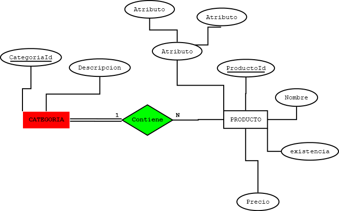
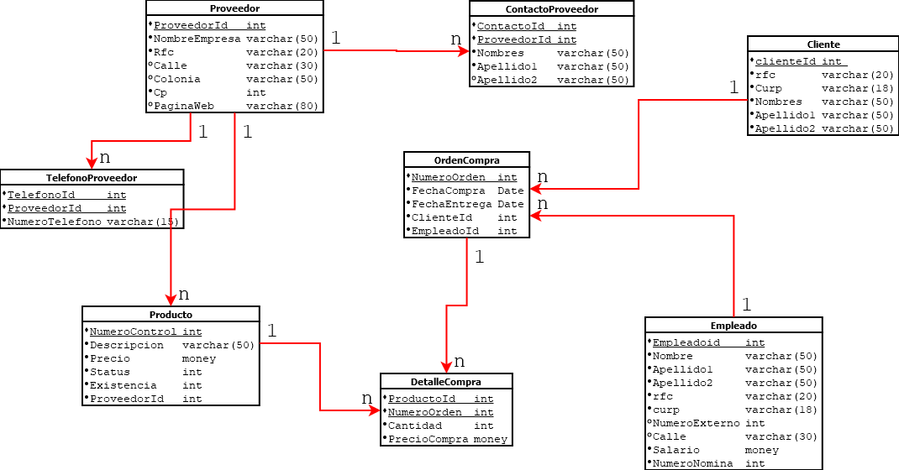

# Requerimientos 

Requerimientos
Una empresa encargada de las ventas de diferentes productos desea crear una base de datos que controles los proveedores, clientes, empleados, y ordenes de compra. para los proveedores se necesita almacenar un numero de control, nombre de la empresa, dirección teléfono, página web, teléfono de contacto, email del contacto pero los empleado se desea almacenar un numero de nómina, nombre completo, RFC, CURP, salario(el salario máximo es de 65000), para las ordenes de compra se necesitan almacenar la fecha de creación de la ordenes  de compra se necesita almacenar la fecha de entrega y los diferentes productos que se le venderán, para esto el producto debe almacenar un numero de control y una descripción, status, existencia, un precio. La compra siempre debe tener un precio de venta que se obtiene del precio unitario del producto 

# Diagrama E-R 



# Diagrama Relacional



# Creacion BD con lenguaje SQL-LDD
``` sql

--crear base de detos 
create database bdVentas;
--utilizar la base de datos
use bdVentas;
--indentity solito va incrementando solito
Create table Cliente(
clienteid int not null identity(1,1),
rfc varchar(20) not null,
curp  varchar(18)not null,
nombre varchar(50)not null,
apellido1 varchar(50)not null,
apellido2 varchar(50)not null
constraint pk_cliente
primary key(clienteid),
constraint unico_rfc
unique(rfc),
constraint unico_curp
unique(curp)
);
--LDD lenguaje de DEFINNICION   datos
--LMD LENGUAJE DE MANIPULACION DE DATOS
create table contactoProvedoor(
contactoid int not null identity(1,1),
proveedorid int not null,
nombres varchar(50)not null,
apellido1 varchar(50)not null,
apellido2 varchar(50)not null,
constraint fk_contactoProveedor
primary key(contactoid)

);
create table proveedor(
proveedorid int not null identity(1,1),
nombreEmpresa varchar(50)not null,
rfc varchar(20)not null,
calle varchar(30) not null,
colonia varchar(50)not null,
cp int not null,
paginaweb varchar(80)
constraint pk_proveedor
primary key(proveedorid),
constraint unico_nombreEmpresa
unique (nombreEmpresa),
constraint unico_rfc2
unique(rfc)
);

alter table contactoProvedoor
add constraint fk_contactoProvedoor_proveedor
foreign key (proveedorid)
references proveedor (proveedorid)


create table empleado(
empleadoid int not null identity(1,1),
nombre varchar(50)not null,
apellido1 varchar(50)not null,
apellido2 varchar(50) not null,
rfc varchar(30) not null,
curp varchar(18)not null,
numeroexterno int,
calle varchar(50)not null,
salario money not null,
numeronomina int not null,
constraint pk_empleado
primary key(empleadoid),
constraint unico_rfc_empleado
unique(rfc),
constraint unico_curp_empleado
unique(curp),
--rango and 

constraint chk_salario
check(salario>=0.0 and salario<=100000),
--check(salario between 0.1 and 100000)
constraint unico_nomina_empleado
unique(numeronomina))


create table telefonoProveedor(
telefonoid int  not null,
proveedorid int not null,
numeroTelefon varchar(15),
constraint pk_telefono_proveedor
primary key(telefonoid,proveedorid),
constraint fk_telefonoprov_proveedor
foreign key(proveedorid)
references proveedor(proveedorid)
on delete cascade
on update cascade 


)

create table producto(
numerocontrol int not null identity(1,1),
descripcion varchar(50)not null,
precio money not null,
[status] int not null,
existencia int not null,
proveedorid int not null,
constraint pk_producto
primary key(numerocontrol),
constraint unico_descripcion
unique(descripcion),
constraint chk_precio
--precio>=1 and precio<=200000
check(precio between 1 and 200000),
constraint chk_status
--status in(0,1)
check ([status]=1 or [status]=0),
constraint chk_existencia 
check(existencia>0),
constraint fr_producto_proveedor
foreign key (proveedorid)
references proveedor(proveedorid)
)

create table ordencompra(
numeroorden int not null identity(1,1),
fechacompra date not null,
fechaentrega date not null,
clienteid int not null,
empleadoid int not null,
constraint pk_ordencompra
primary key(numeroorden),
foreign key(clienteid)
references cliente(clienteid),
constraint fk_ordencompra_cliente
foreign key (empleadoid)
references empleado(empleadoid)
)
create table detalleCompra(
productoid int not null,
numeroorden int not null,
cantidad int not null,
precioCompra money not null
constraint pk_detalleCompra
--foreing key compuesta
primary key(productoid,numeroorden),
constraint fk_ordencompra_producto
foreign key(productoid)
references producto(numerocontrol),
constraint fk_ordencompra_compra
foreign key (numeroorden)
references ordencompra(numeroorden)

)
```
# Llenar base de datos con lenguaje SQL-LMD

``` sql
use [bdVentas]

select * from [Northwind].dbo.Customers
go
select * from Cliente
go

-- insertar en la tabla cliente 

insert into Cliente(rfc,curp,nombre,apellido1,apellido2)
values ('hybvcfvghb', 'MEAA115809HHGZRLA5', 'Antonio Moreno Taquería', 'hbdhjksiav', 'Futterkiste'),
('hkjnhsjdgbjs', 'MEAA115809HHGZRLA0', 'Alfreds Futterkiste', 'hbdhjksfav', 'Futterkiste')


delete Cliente

-- comando para reiniciar el identity de una tabla
DBCC CHECKIDENT (Cliente, RESEED,0)

-- crea una tabala apartir 
select top 0 EmployeeID as 'EmpleadoID', LastName as 'Apellido', FirstName as 'PrimerNombre', BirthDate as'FechaNacimiento', HireDate as 'FechaContratacion', [Address] as 'Direccion', City as 'Ciudad', Region, PostalCode as 'CodigoPostal', Country as 'Pais' into empleado2 from Northwind.dbo.Employees


select top 5 * from Northwind.dbo.[Order Details]
order by OrderID desc 


--Insertar datos a partir de una lista 

select * from empleado2

drop table empleado2

alter table empleado2   --
add constraint pk_empleado
primary key (empleadoID)


insert into empleado2 (EmpleadoID,Apellido,PrimerNombre,FechaNacimiento,FechaContratacion, Direccion,Ciudad,Region,CodigoPostal,Pais)
select EmployeeID as 'EmpleadoID', LastName as 'Apellido', FirstName as 'PrimerNombre', BirthDate as'FechaNacimiento', HireDate as 'FechaContratacion', [Address] as 'Direccion', City as 'Ciudad', Region, PostalCode as 'CodigoPostal', Country as 'Pais'
from Northwind.dbo.Employees


select * from empleado
select * from cliente 
select * from ordencompra

insert into empleado(nombre, apellido1, apellido2, curp, rfc,numeroexterno,calle,salario,numeronomina) values
('Alan', 'Santiago', 'Molina', 'ALAN0903467HHGRLA0', 'Alan326587', 23, 'calle del infierno', 6778.87, 12345),
('Yamileth', 'Mejia', 'Rangel', 'YAMI547697FFGZJDA8', 'YAMI457643', NULL, 'Calle del Hambire', 78765.9, 54321),
('Moises', 'Santiago', 'Isidro', 'MOIS547697FFGZJDA8', 'MOIS877643', NULL, 'Calle de la gordura', 9000, 98674)


insert into ordencompra
values (GETDATE(),'2024-06-10', 1,3),
   	(GETDATE(), '2024-07-11', 3,4 ),


select * from producto
select * from proveedor
select * from Northwind.dbo.Suppliers

insert into proveedor
select SupplierID, CompanyName, PostalCode, 'Calle de la soledad', City, 2345 as cp, 'www.prueba.com.mx' 
from Northwind.dbo.Suppliers

delete from proveedor


select * from producto

insert into producto (numerocontrol, descripcion, precio,[status], existencia,proveedorid)
select ProductID, ProductName, UnitPrice, Discontinued, UnitsInStock, SupplierID  from Northwind.dbo.Products


select * from detalleCompra


insert into detalleCompra 
values (2, 2, 20 ,
(select precio from producto where numerocontrol =2))


update producto
set precio = 20.2
where numerocontrol = 1


select * from producto 
where numerocontrol = 1

-- seleccionar las oredenes de compra del producto uno
select *, (cantidad * precioCompra) as importe 
from detalleCompra
where productoid = 1

select sum(cantidad * precioCompra) as 'total'
from detalleCompra
where productoid = 1


-- seleciona la fecha actual del sistema 
select GETDATE()


```


